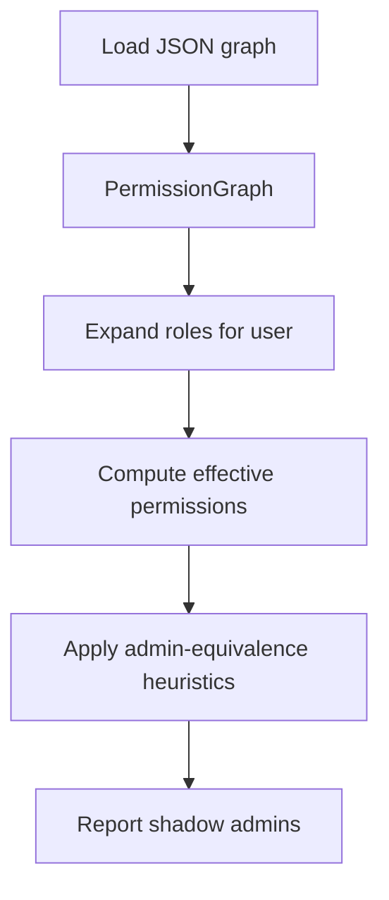

# Shadow Admin Detector — Architect's Narrative

This document surfaces the solution architect's thinking: goals, design trade-offs, analysis pipeline, and next steps. It's intentionally narrative-first so a recruiter or security architect can follow the reasoning.

## Goals

- Detect accounts with effective admin-equivalent privileges even when they do not hold an explicit `Admin` role.
- Produce explainable results that are actionable for security teams.
- Keep the implementation small and testable so an engineer can extend it to cloud IAM exports.

## High-level design

- Data model: a permission graph with `users` and `roles`.
  - `roles` may include other roles (role composition / inheritance) and may `grant` permissions.
  - `users` map to assigned role names.
- Analysis pipeline:
  1. Expand a user's assigned roles transitively (walk role inclusion edges).

2.  Union all grants from reachable roles to compute effective permissions.
3.  Apply heuristics to determine admin-equivalence (for this demo: any permission name containing `admin`).
4.  Flag users who are admin-equivalent but whose assigned roles are not explicitly admin-labeled.

## Reasoning and trade-offs

- Simplicity: using role inclusion + grants keeps the model explainable and easy to map from cloud exports (GCP, AWS, Azure, GitHub).
- Heuristics vs. policy engine: this demo uses simple name-based heuristics; production systems should use scoring and resource-scoped checks to avoid false positives.
- Extensibility: the model admits graphs with attributes (conditions, scoping). You can plug a richer evaluator later (Rego, OPA, custom rule engines).

## Implementation sketch (pipeline)

## Example heuristics

- Admin-equivalent if any permission string includes `admin` (case-insensitive).
- Explicit admin role if assigned role name includes `admin`.
- Future: map sets of lower-privilege permissions that together imply admin-equivalence.

## Operational notes

- Inputs: exported JSON snapshots from IAM systems or a CSV/NDJSON converter.
- Outputs: small JSON reports, optionally enriched with the path of roles that produce admin privileges.
- Running in CI: snapshot the graph and run the detector in a scheduled workflow; alert on increases of shadow admins.

## Next steps (for interview talking points)

- Add scoring, resource scoping, and confidence levels for each finding.
- Add visualization and dashboarding (networkx + pyvis) to make findings easy to discuss with stakeholders.
- Connect to provider SDKs (boto3, google-cloud-iam) to ingest real data and validate results.
